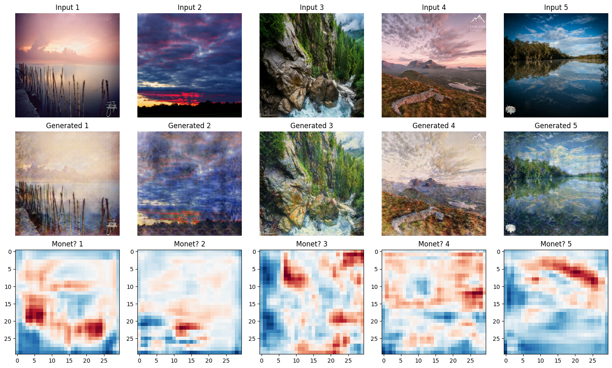

UC Boulder MSDS course work  
DTSA 5511 Deep Learning  

## Mini-Project   Photo to Monet Style Images CycleGAN

This [notebook](https://github.com/elfchildRichter/Monet_Style_Images_CycleGAN) uses **cycleGAN** to generate Monet-style images from photos. The data is sourced from [kaggle](https://www.kaggle.com/competitions/gan-getting-started) and includes **monet_tfrec** - 300 Monet paintings sized 256x256 in TFRecord format, and **photo_tfrec** 7028 photos sized 256x256 in TFRecord format.

## Prediction

## Summary

From stylized images, generative models show good performance in capturing the main features and color compositions of the input images, yet there are subtle differences in details and textures. An improvement in the quality of generated images can be observed from the last three epochs, coming closer to real images in the Monet style, which corresponds with a decrease in the MiFID score. The model shows more accurate simulation of the Monet style in the final training cycles, indicating progress in generating stylistically consistent images.

Additionally, the increase in blue areas in the color block diagram indicates a higher proportion of images being identified by the discriminator as in the Monet Style. This suggests that the model may have captured key stylistic elements of Monet's painting style, such as color temperature, light reflection, or overall structure, representing progress in the generator's imitation of the target style. However, ideally, the discriminator in cycleGAN training should also continuously improve its performance, enabling more precise discrimination to foster progress through ongoing competition between the two.

The fluctuations during the training process may be caused by insufficient diversity in the training data, model overfitting, or the need for finer adjustments in the learning rate or other training parameters. These are areas for improvement in future model training processes.
